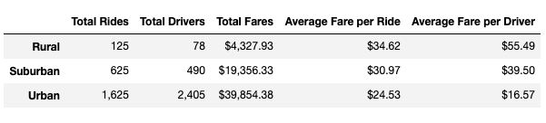
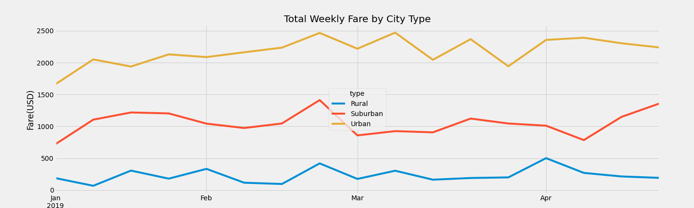

<h1 align="center"> PyBer Ride Sharing Analysis</h1>

## Overview of Analysis

A ride sharing start-up, PyBer, needed to analyze their recent ride sharing data and understand how fares differ on a weekly basis in each city type. 

## Tools

* Jupyter Notebook
* Matplotlib
* Pandas

## Methods, Results and Discussion

Using the data provided from [Ride Data](Resources/ride_data.csv) and [City Data](Resources/city_data.csv), a merged datafram was created to analyze all data in one location. From there, a secondary dataframe was created to analyze summary statistics organized by city type (Urban, Suburban, Rural). The following was observed:

Secondly, PyBer was interested in time-series detail on the sum of weekly fares for each city type. See below for the mulit-line graph:

 

Both outputs show some stirking disparities between Urban cities and the rest. In Urban cites, there is 13x the amount of rides when comapred to Rural and 2.6x the amount of rides than in Suburbs. Naturally, there is over 30x the amount of drivers when compared to Rural cities, and almsot 5x comapred ot Suburban citites. More rides equals more revenue. Urabn cities rank hgihest in total fares but last in average fare per ride and average fare per driver. There are natural reason fors this. Urban cities are much more densely populated than suburbs and rural areas, and thus citiznes use the app more often. Also, it can be assumed that a majority of the trips take Urban riders are taking are shorter than those of suburban and rural riders, which would explain te lower average fares. However, more analysis would be needed to confirm the hypotheses. 

Apply the same reasoning to the time-series graph, Urban citites also rank high in weekly fare totals over the four moht period analyzed. Simply put, more driver + more rides = more revenue. 

To address these discrepencies, PyBer management can do several things:

*Offer incentives for drivers and riders in suburban and rural Cities*

Offering incentives (i.e. garauntee a certain proft for the first month) could encourage more drivers to sign up as gig-workers in the app. By the same token, offering riders incentives in these areas could encourage more to call for a car on the app than by other means. For instance, 10% discount for your first 10 rides. 

*Change the profit structure for drivers depending on location*

Setting the profit structure as a varying scale depending on where a ride types palce could encourage more drivers to take calls from other cities types. 

*Add discounts based on distance*

While more analysis would be required, something to look at is offering discounts based on length of ride. In rural areas, it may be that riders do not want to pay the high price to driver the longer distance bewteen destinations. Offering a discount based on how far your trip is could help activate the rural markets more. 

